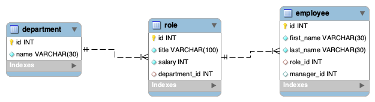

# EmployeeTracker

The EmployeeTracker application allows a user to create, read, update and delete Employees, Department and Roles from a company database. This will allow users to interact with the data in a more meaningful way.

[EmployeeTracker application can be found on github repository ](https://github.com/ktywelch/EmployeTracker)

## Table of contents
* [Design](#Design)
* [Installation](#Installation)
* [Usage](#Usage)
* [Technologies](#Technologies)
* [Contributions](#Contributions)
* [License](#License)

##Design
The design employed is to use distributed files containing functions that could be called and referenced by the main app as needed.

###The dependent modules created in the ./lib folder  are:
* actions.js  - variable of actions for the main menu inquirer 
* connection.js - the DB connection parameters
* employee.js - Employee functions and global functions such as budget lists
* role.js - Contains functions to manipulate the company roles
* department.js - Contains functions to work with the departments
* ./Assets/Supporting/seeding.sql - sql script to create the DataBase Schema and to populate two records in each field

###External Function Naming Conventions:
* inq - inquirer function
* sel - inquirer function to select choice
* add - sql add function
* del - sql delete function
* get - sql select function
* upd - sql update function

###Database:

Datamodel utilizes three tables with relationships established through foreign keys-

## Installation
The installation pocess is a download of git source, using npm install to install required modules based on the package.json file included in the same directory as the application.

#Usage
#Technologies
#Contributions
#License
